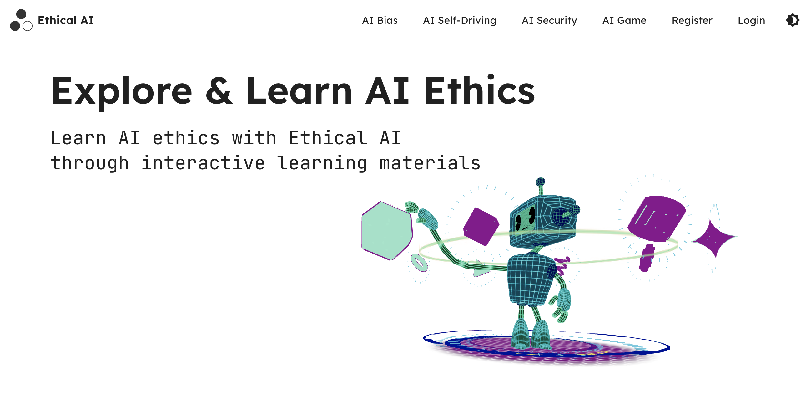

<!-- LOGO SECTION -->
<div align="center">
  <a href="https://github.com/uoa-compsci399-s2-2023/capstone-project-team-2">
    
  </a>

  <h2 align="center">Ethical AI</h2>
  <p align="center">
    A UoA interactive website for teaching AI Ethics
    🤖
    <br />
    <a href="https://main.d372yvefo3gajj.amplifyapp.com/">Live Demo</a>
    ·
    <a href="https://trello.com/invite/b/479zM6f5/ATTI38bbd529104c7490d7a096b399262cfb47502E12/main-project-development">Trello Board</a>
  </p>
</div>

## About

<div align="center">
  
  <br />
</div>

Ethical AI is an interactive, extensible web application design to teach students and users about ethical issues surrounding emergent trends in Artificial Intelligence.

Built as part of *COMPSCI 399 - Capstone Project in Computer Science*, at the University of Auckland, Ethical AI has been designed to break down complex, rapidly-evolving issues arising with the growing usage and popularity of Artificial Intelligence. Instead making them digestible for those without a technical background, whilst conveying key ethical takeaways for users.

The web application is broken down into four distinct, extensible modules. The first module queries two GPT chat instances, each trained in a way that convicingly biases them in different directions. The second is an interactive ethical dilemma centred around self-driving cars. Third is a 'choose-your-own-adventure' module, which puts the user in a number of different roles in which AI may be employed in a professional setting, and asks them to make decisions working towards a number of endings. A final module is a collection of extended reading material and articles for users to explore the topics covered further.

A more detailed rundown of our background research, planning, and design decisions, as well as technical detail can be found in [this report.]()

---
## Technology Used


Ethical AI is built as a dynamic, full-stack web application. The frontend was built with React, Tailwind CSS, and Vite, whilst the backend uses Node.js and express, with a MongoDB NoSQL database. In our given implementation, the application is hosted using AWS Amplify. Javascript and Typescript are the primary languages used, in addition to the typical web languages including HTML and CSS.

---
## Installation

Get started by cloning the repository:

```bash
git clone https://github.com/uoa-compsci399-s2-2023/capstone-project-team-2.git
```

Ethical AI is built on the [Node.js](https://nodejs.org/en) Javascript runtime environment. You can download Node directly via [this link](https://nodejs.org/en), or through a package manager of your choice:

### MacOS

You can either pull the pkg directly from source using cURL, or using Homebrew.

Using cURL:
```bash
curl "https://nodejs.org/dist/latest/node-${VERSION:-$(wget -qO- https://nodejs.org/dist/latest/ | sed -nE 's|.*>node-(.*)\.pkg</a>.*|\1|p')}.pkg" > "$HOME/Downloads/node-latest.pkg" && sudo installer -store -pkg "$HOME/Downloads/node-latest.pkg" -target "/"
```
Using [Homebrew](https://brew.sh/) 🍺:
```bash
brew install node
```

### Windows

You can install directly using the [installer](https://nodejs.org/en/download/package-manager#debian-and-ubuntu-based-linux-distributions:~:text=Download%20the-,Windows%20Installer,-directly%20from%20the), or using Winget.

Using Winget:
```powershell
winget install OpenJS.NodeJS
```

### Other package managers

Node maintains a list of other supported operating systems, including linux distributions, with relevant installers [here](https://nodejs.org/en/download/package-manager).

---

Next, we can install the frontend by changing directory into the client folder, then installing the dependencies using npm.

```bash
cd client
npm install
```
At this point, you may to run the application with only the frontend client by running `npm run dev`, however some features such as login will be unavailable, due to its reliance on the backend. 

---

Next, we will setup the backend by moving into the server directory:

```bash
cd capstone-project-team-2/server
```
Once in this directory, we need to setup the environment variables. First, create a copy of `.env_example` envionrment variables template file, and name it `.ENV`. In this new file you should look to add your own credentials for a [MongoDB](mongodb.com) server as shown below:

```
MONGODB_CONNECTION= # insert your connection here
AI_EDUCATOR_SECRET= # can be any random string
PORT=8080 # to override default port if desired
```
The string `AI_EDUCATOR_SECRET` can be any string, as it is used for hashing purposes, the `PORT` variable simply overrides the default port to one of your choice, in this case `8080`.

Still in the server folder, run `npm install` as for the frontend to install dependencies. Then simply run the following commands:

```bash
npm i -D
npm start
```

## Future Plans

In its current form, Ethical AI is designed for extensibility, we would therefore look to design and build additional modules and content to cover a wider range of topics. To further this, we would refactor our code to accomodate a content management system, so that administrators without technical knowledge or an understanding of the code can easily add media and content to the site. 

In terms of specific functionality, we would look to add a leaderboard to the self driving car module, so that users can compare their decisions to other users and understand where their decision making fits in statistically. More critically, we would look to add support for classroom management, whereby a student cohort using the site can be assigned modules by a lecturer or supervisor, making it easy for the site to function as core teaching material and for instructors to track progress.

## Authors

<div align="center">
  
</div>


## Acknolwedgements

We would like to acknowledge the teaching team for COMPSCI 399, Dr. Asma Shakil, Anna Trofimova, and teaching assistant Sai Yekula. As well as our client supervisors Dr. Danielle Lottridge and Thomas Lacombe, for their valuable guidance, feedback, and without whom we would not have had the opportunity to create Ethical AI.
